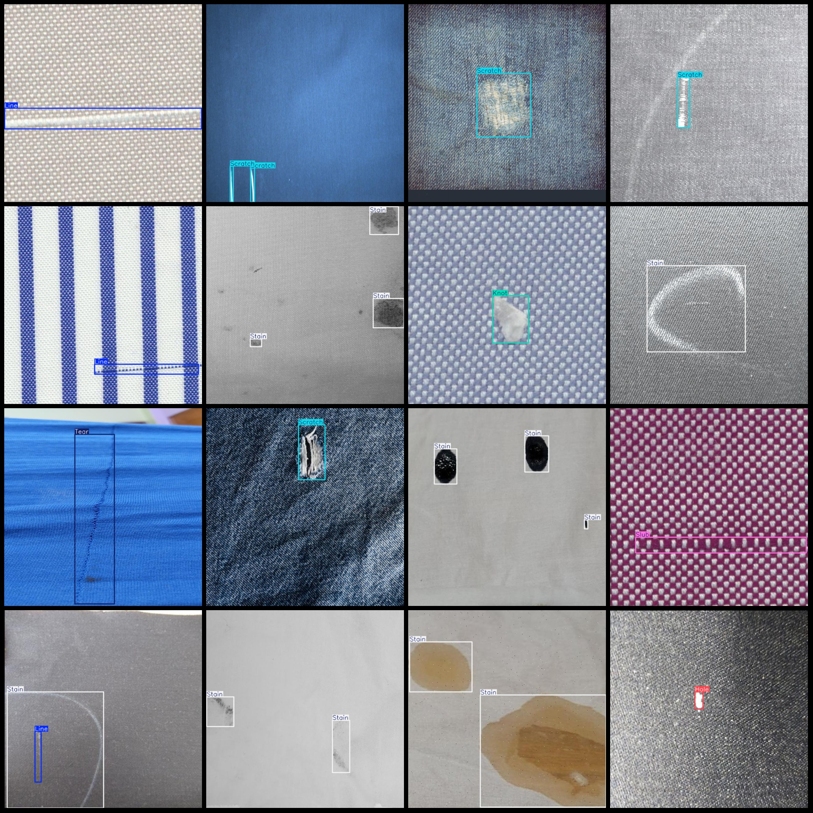
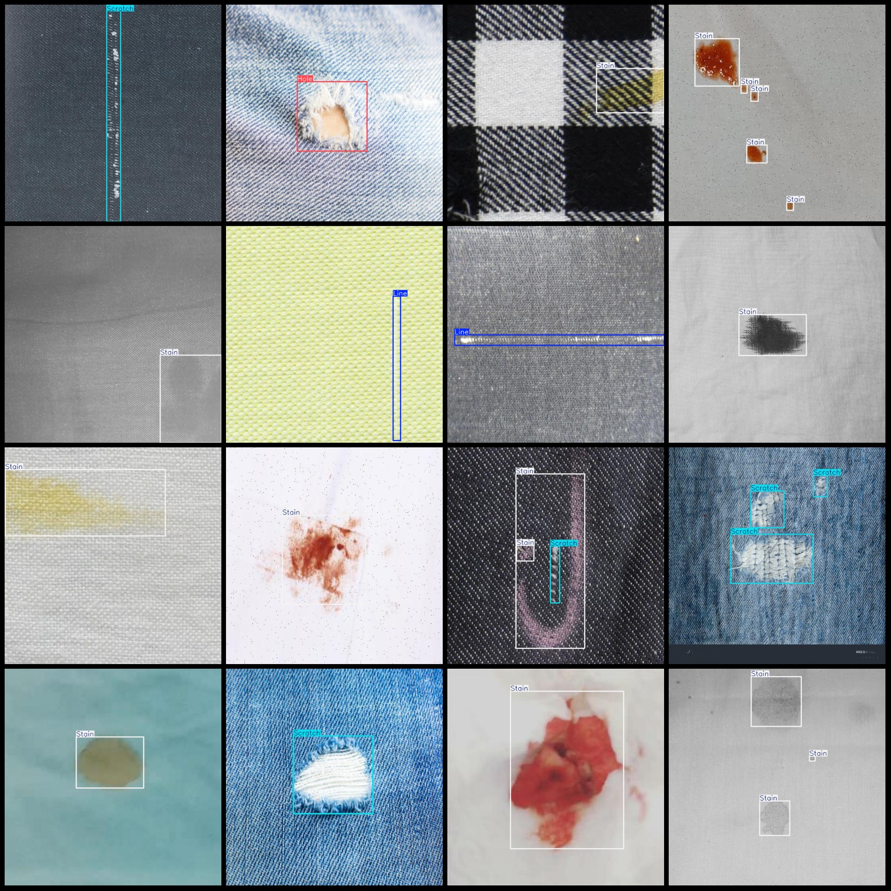

# Smart Textile Industry Fabric Holes, Scars, Tears, Fray, Scrapes, Scratches, Creases, Hair, Stains, Tear Defects Detection Dataset in VOC+YOLO format with 2045 images across 10 categories

The dataset format is Pascal VOC format + YOLO format. It does not include the split path in the txtfile, but only contains the jpgimage and corresponding VOC format xmlfile and yolo format txtfile.

number of images: 2045
annotation count: 2045
AnnotationClass number: 10
annotation class names: ["Hole", "Knot", "Line", "Open Seam", "Pull Thread", "Scratch", "Seam Puckering", "Slub", "Stain", "Tear"]
boxes per class: 
- Hole : 234
- Knot : 128
- Line : 271
- Open Seam : 63
- Pull Thread : 80
- Scratch : 841
- Seam Puckering : 71
- Slub : 62
The number of stains (marks) is 1344.
Tear box count = 128
total boxes: 3222  
image resolution: 640x640  
Use annotation tool: labelImg
Annotation rules: Draw a rectangle box around the class.
Important notes: The dataset needs to be divided into training, validation, and test sets.
Special statement: This dataset does not guarantee the accuracy of the trained model or weight files.
Image preview:
## Images

Here is a pay link on Stripe ( https://buy.stripe.com/3cs8yP7sY87d0vu9AB ). Please contact me lonlonago@foxmail.com after funding $89, and I will send you a complete data files , thank you!

